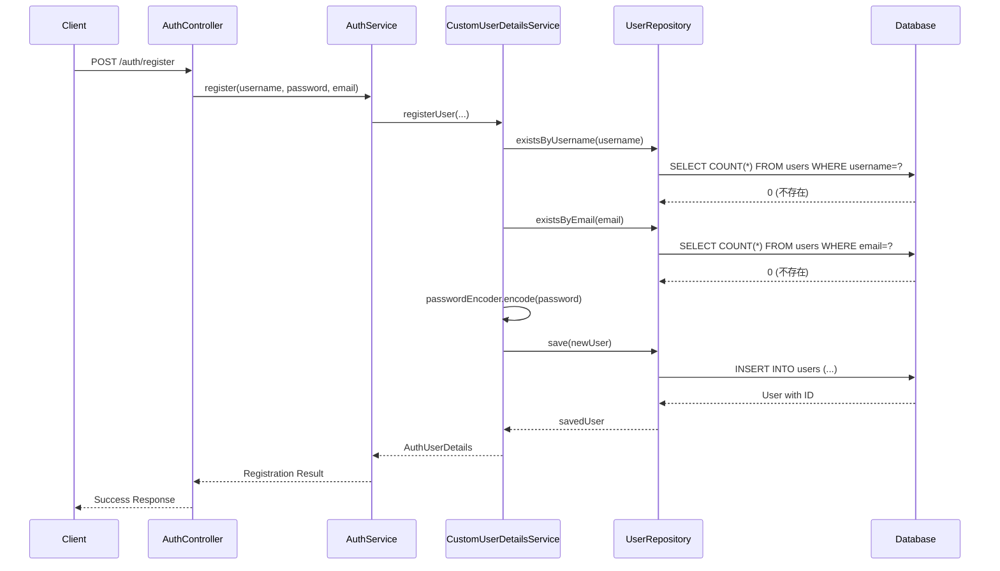
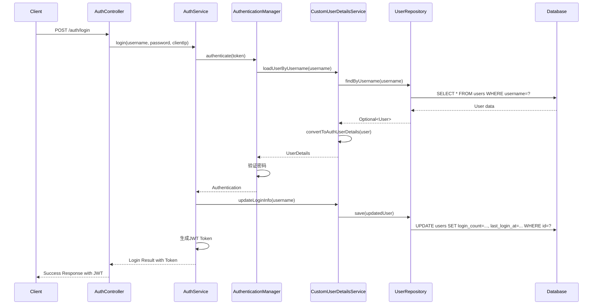

# 🗄️ 数据库集成完整指南

## 📋 集成概览

已成功将用户注册和登录功能从内存存储迁移到数据库存储，实现了真正的数据持久化。

## 🏗️ 架构变更

### 之前：内存存储
```java
// ❌ 旧方案：使用ConcurrentHashMap存储用户
private final Map<String, AuthUserDetails> users = new ConcurrentHashMap<>();
```

### 现在：数据库存储
```java
// ✅ 新方案：使用JPA + MySQL存储用户
@Autowired
private UserRepository userRepository;
```

## 📦 核心组件

### 1. User实体类 (`User.java`)
```java
@Entity
@Table(name = "users")
public class User {
    @Id
    @GeneratedValue(strategy = GenerationType.IDENTITY)
    private Long id;
    
    @Column(unique = true, nullable = false)
    private String username;
    
    @JsonIgnore
    private String password; // BCrypt编码
    
    @Column(unique = true, nullable = false)
    private String email;
    
    private Boolean enabled = true;
    private String role = "USER";
    private LocalDateTime createdAt;
    private LocalDateTime lastLoginAt;
    private Integer loginCount = 0;
    
    // ... getters, setters, 业务方法
}
```

**特性**：
- ✅ **自动时间戳**：创建时间、更新时间自动管理
- ✅ **密码安全**：`@JsonIgnore`防止密码泄露
- ✅ **唯一约束**：用户名和邮箱唯一
- ✅ **登录统计**：记录登录次数和最后登录时间
- ✅ **索引优化**：关键字段建立索引

### 2. UserRepository接口 (`UserRepository.java`)
```java
@Repository
public interface UserRepository extends JpaRepository<User, Long> {
    Optional<User> findByUsername(String username);
    Optional<User> findByEmail(String email);
    boolean existsByUsername(String username);
    boolean existsByEmail(String email);
    
    @Query("SELECT u FROM User u WHERE u.lastLoginAt >= :since")
    List<User> findRecentlyLoggedInUsers(@Param("since") LocalDateTime since);
    
    @Modifying
    @Query("UPDATE User u SET u.lastLoginAt = :loginTime, u.loginCount = u.loginCount + 1 WHERE u.id = :userId")
    void updateLoginInfo(@Param("userId") Long userId, @Param("loginTime") LocalDateTime loginTime);
    
    // ... 更多查询方法
}
```

**特性**：
- ✅ **基础CRUD**：继承`JpaRepository`
- ✅ **自定义查询**：用户名、邮箱查询
- ✅ **存在性检查**：防重复注册
- ✅ **统计查询**：用户活跃度分析
- ✅ **批量操作**：更新登录信息

### 3. 升级的CustomUserDetailsService
```java
@Service
@Transactional
public class CustomUserDetailsService implements UserDetailsService {
    
    @Autowired
    private UserRepository userRepository;
    
    @Override
    @Transactional(readOnly = true)
    public UserDetails loadUserByUsername(String username) {
        // 从数据库查询用户
        Optional<User> userOpt = userRepository.findByUsername(username);
        
        if (userOpt.isPresent()) {
            return convertToAuthUserDetails(userOpt.get());
        }
        
        // 创建默认admin用户（如果不存在）
        if ("admin".equals(username)) {
            User adminUser = createDefaultAdminUser();
            return convertToAuthUserDetails(adminUser);
        }
        
        throw new UsernameNotFoundException("用户不存在: " + username);
    }
    
    public AuthUserDetails registerUser(String username, String password, String email) {
        // 检查重复
        if (userRepository.existsByUsername(username)) {
            throw new RuntimeException("用户名已存在");
        }
        if (userRepository.existsByEmail(email)) {
            throw new RuntimeException("邮箱已存在");
        }
        
        // 创建并保存用户
        User newUser = new User();
        newUser.setUsername(username);
        newUser.setPassword(passwordEncoder.encode(password));
        newUser.setEmail(email);
        newUser.setRole("USER");
        // ... 设置其他属性
        
        User savedUser = userRepository.save(newUser);
        return convertToAuthUserDetails(savedUser);
    }
}
```

## 🗃️ 数据库表结构

### users表
```sql
CREATE TABLE users (
    id BIGINT AUTO_INCREMENT PRIMARY KEY,
    username VARCHAR(50) NOT NULL UNIQUE,
    password VARCHAR(100) NOT NULL,
    email VARCHAR(100) NOT NULL UNIQUE,
    enabled BOOLEAN NOT NULL DEFAULT TRUE,
    account_non_expired BOOLEAN NOT NULL DEFAULT TRUE,
    account_non_locked BOOLEAN NOT NULL DEFAULT TRUE,
    credentials_non_expired BOOLEAN NOT NULL DEFAULT TRUE,
    role VARCHAR(20) NOT NULL DEFAULT 'USER',
    created_at DATETIME NOT NULL DEFAULT CURRENT_TIMESTAMP,
    updated_at DATETIME DEFAULT CURRENT_TIMESTAMP ON UPDATE CURRENT_TIMESTAMP,
    last_login_at DATETIME,
    login_count INT NOT NULL DEFAULT 0,
    
    INDEX idx_username (username),
    INDEX idx_email (email),
    INDEX idx_role (role),
    INDEX idx_enabled (enabled)
);
```

## ⚙️ 配置文件

### auth-module配置 (`application.yml`)
```yaml
spring:
  # 数据源配置
  datasource:
    url: jdbc:mysql://${server.config.database.host}:${server.config.database.port}/multi_module_dev
    username: ${server.config.database.username}
    password: ${server.config.database.password}
    driver-class-name: com.mysql.cj.jdbc.Driver
    
    # 连接池配置
    hikari:
      maximum-pool-size: 20
      minimum-idle: 5
      idle-timeout: 300000
  
  # JPA配置
  jpa:
    hibernate:
      ddl-auto: update  # 自动创建/更新表结构
    show-sql: true
    properties:
      hibernate:
        dialect: org.hibernate.dialect.MySQL8Dialect
        format_sql: true
  
  # Redis配置（用于缓存和会话）
  redis:
    host: ${server.config.redis.host}
    port: ${server.config.redis.port}
    password: ${server.config.redis.password}
    database: ${server.config.redis.database}
```

## 🔄 数据流程

### 注册流程


### 登录流程


## 🧪 测试步骤

### 1. 准备数据库
```bash
# 连接MySQL数据库
mysql -u root -p

# 创建数据库（如果不存在）
CREATE DATABASE IF NOT EXISTS multi_module_dev CHARACTER SET utf8mb4 COLLATE utf8mb4_unicode_ci;

# 使用数据库
USE multi_module_dev;

# 执行建表脚本
SOURCE create-users-table.sql;
```

### 2. 启动服务
```bash
cd auth-module
mvn spring-boot:run
```

### 3. 测试注册
```bash
curl -X POST "http://localhost:8081/auth/register" \
  -H "Content-Type: application/json" \
  -d '{
    "username": "testuser",
    "password": "test123",
    "email": "test@example.com"
  }'
```

### 4. 验证数据库
```sql
-- 查看用户表数据
SELECT id, username, email, role, enabled, created_at, login_count FROM users;

-- 应该看到新注册的用户
```

### 5. 测试登录
```bash
curl -X POST "http://localhost:8081/auth/login" \
  -H "Content-Type: application/json" \
  -d '{
    "username": "testuser",
    "password": "test123"
  }'
```

### 6. 验证登录统计
```sql
-- 查看登录统计更新
SELECT username, login_count, last_login_at FROM users WHERE username = 'testuser';

-- login_count应该增加，last_login_at应该更新
```

## 📊 数据库优势

### 1. **数据持久化**
- ✅ 用户数据永久保存
- ✅ 服务重启不丢失数据
- ✅ 支持数据备份和恢复

### 2. **并发安全**
- ✅ 数据库级别的并发控制
- ✅ 事务保证数据一致性
- ✅ 乐观锁防止数据冲突

### 3. **查询能力**
- ✅ 复杂查询和统计
- ✅ 索引优化性能
- ✅ 支持分页和排序

### 4. **扩展性**
- ✅ 支持水平扩展
- ✅ 主从复制提高可用性
- ✅ 分库分表支持大数据量

## 🔧 故障排除

### 常见问题

#### 1. 数据库连接失败
```
Could not open JPA EntityManager for transaction
```
**解决方案**：
- 检查数据库服务是否启动
- 验证连接参数（host、port、username、password）
- 确认数据库存在

#### 2. 表不存在
```
Table 'multi_module_dev.users' doesn't exist
```
**解决方案**：
- 执行 `create-users-table.sql` 建表脚本
- 或设置 `spring.jpa.hibernate.ddl-auto=create` 自动建表

#### 3. 重复键错误
```
Duplicate entry 'username' for key 'users.username'
```
**解决方案**：
- 这是正常的业务逻辑，用户名已存在
- 前端应提示用户选择其他用户名

#### 4. 密码验证失败
```
Bad credentials
```
**解决方案**：
- 确认密码编码一致性
- 检查BCrypt编码是否正确

## 🎯 性能优化

### 1. 数据库索引
```sql
-- 已创建的关键索引
CREATE INDEX idx_username ON users(username);
CREATE INDEX idx_email ON users(email);
CREATE INDEX idx_last_login_at ON users(last_login_at);
```

### 2. 连接池优化
```yaml
spring:
  datasource:
    hikari:
      maximum-pool-size: 20      # 最大连接数
      minimum-idle: 5            # 最小空闲连接
      idle-timeout: 300000       # 空闲超时
      connection-timeout: 20000  # 连接超时
```

### 3. 查询优化
```java
// 使用@Transactional(readOnly = true)优化只读查询
@Transactional(readOnly = true)
public UserDetails loadUserByUsername(String username) {
    // ...
}

// 使用批量操作减少数据库访问
@Modifying
@Query("UPDATE User u SET u.enabled = :enabled WHERE u.id IN :userIds")
void updateUsersEnabled(@Param("userIds") List<Long> userIds, @Param("enabled") Boolean enabled);
```

## 🎉 集成完成

数据库集成已完全完成！现在系统具有：

- ✅ **真正的数据持久化**：用户数据保存在MySQL数据库
- ✅ **完整的用户管理**：注册、登录、信息更新
- ✅ **安全的密码存储**：BCrypt编码
- ✅ **登录统计功能**：记录登录次数和时间
- ✅ **数据完整性约束**：用户名和邮箱唯一
- ✅ **高性能查询**：索引优化
- ✅ **事务安全**：数据一致性保证

**用户注册和登录现在完全基于数据库运行！** 🚀
